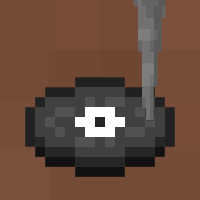

# Needledrop

A Fabric mod for Minecraft that scans a folder of music on your computer and
turns every song into a findable, playable jukebox disc — with an icon
tinted to the color of that song's own album art.



## What it does

- You point it at a folder (your Music folder, a playlist folder, whatever)
  and it converts every song in there into an in-game music disc.
- Each disc's icon is colored using the most visually dominant color pulled
  from that song's embedded cover art, so your discs are visually
  distinguishable at a glance.
- Discs can turn up while exploring — abandoned mineshafts, End city
  treasure, strongholds, dungeons, buried treasure — or you can just
  `/give` them to yourself in creative mode.
- An in-game menu (a note-shaped button next to "Singleplayer" on the title
  screen) lets you:
  - **Browse music folder…** — pick which folder to scan, with a normal
    Windows folder picker.
  - **Rescan & Convert** — re-scan that folder and convert anything new.
  - **Edit Library** — turn any song on/off globally (a search box helps if
    your library is large).
  - **Edit Per-World Discs** — pick a save, then turn songs on/off just for
    that world (a world you haven't customized just uses your global list).
- No cap on how many songs/discs you can have.

**Singleplayer / "Open to LAN" only, by design.** A dedicated server has no
single folder that makes sense as "the server's music," so the mod does
nothing on one.

## Requirements

- **Minecraft 26.2**
- **Fabric Loader** `0.19.3` or newer
- **Fabric API** `0.158.0+26.2`
- **Java 25**
- **ffmpeg**, installed and available on your system `PATH` (used to
  convert your songs and pull out their embedded cover art)

## Installing

1. Install [Fabric Loader](https://fabricmc.net/use/) for Minecraft 26.2.
2. Download **Fabric API** for 26.2, and grab this mod's `.jar` from the
   [`dist/`](dist/) folder in this repo (or build it yourself with
   `gradle build`, which puts a fresh one in `build/libs/`).
3. Drop both `.jar` files into your `mods` folder.
4. Make sure `ffmpeg` is installed and on your `PATH` — the mod shells out
   to it to convert your songs. If you're not sure, open a terminal and run
   `ffmpeg -version`; if that fails, [install ffmpeg](https://ffmpeg.org/download.html)
   first.
5. Launch the game once. On first launch the mod scans your Windows Music
   folder by default — for a large library this can take a while, since
   ffmpeg does real work per file. Use **Browse music folder…** from the
   in-game menu afterward if you want to point it somewhere else.

## Using it

- Click the note-shaped button next to **Singleplayer** on the title screen
  to open the menu.
- First time in a world, discs you already know about work immediately —
  find one, `/give` one, or wait for one to turn up as loot.
- **Newly added songs need a game restart** before they become real,
  usable items (Minecraft locks in its item list at boot). Toggling an
  *already-known* song on/off doesn't need a restart — just a world reload
  or `/reload`.
- The generated resource pack (icons, sounds, item names) enables itself
  automatically; no manual step needed in Options > Resource Packs.

## FAQ / troubleshooting

**A disc has no sound.**
Most likely a source file's audio didn't convert cleanly. Try "Rescan &
Convert" once; if it still doesn't play, check that file plays fine in
a normal media player.

**"Browse music folder…" doesn't open a window.**
This uses your system's normal folder picker running alongside the game.
If nothing appears, check whether it opened *behind* the Minecraft window
(alt-tab), and make sure your Java install includes a graphical (AWT/Swing)
component — this is standard on almost every install.

**A song I just added isn't a real item yet.**
Restart the game. Minecraft only registers items at boot, so brand new
songs show up in "Edit Library" right away but need a relaunch to actually
exist as discs. Songs you already had don't need this.

**Discs look wrong / have a missing-texture checkerboard.**
This shouldn't happen — the generated resource pack enables itself. If it
somehow got disabled, check Options > Resource Packs and make sure
"Needledrop" is on the *Selected* side, then restart.

**A world I made before installing the mod doesn't seem to have loot
discs.**
Run `/reload` once in that world.

**I explored a whole structure and never found a single disc.**
The chance is *per eligible chest*, not per structure or per song — it
doesn't go up with a bigger library, only the *variety* does if a roll
succeeds. A single structure often only has a handful of chests, so
finding zero in one visit can still happen. Chests are more common in
the Nether and End, so the odds are higher there by default too:

| Where | Structures | Default chance per chest |
|---|---|---|
| Overworld | mineshafts, strongholds, dungeons, buried treasure | 35% |
| Nether | bastion remnants, nether fortresses | 50% |
| End | End city treasure (including the ship) | 60% |

Want different odds? Edit `"lootChanceOverworld"` / `"lootChanceNether"` /
`"lootChanceEnd"` in `config/musicdiscs.json` (0.0–1.0 each).

**ffmpeg errors in the log / "Could not run ffmpeg."**
The mod couldn't find or run ffmpeg. Confirm `ffmpeg -version` works in a
terminal; if it needs a full path instead of just being on `PATH`, you can
set that in `config/musicdiscs.json` (`ffmpegPath`).

**Can I use this on a server with friends?**
Only singleplayer or "Open to LAN" from a singleplayer world — see
"What it does" above for why.

## For developers

See [`CLAUDE.md`](CLAUDE.md) for the original design brief, architecture
notes, and the trickier Minecraft-26.2-specific fixes this project needed
(API renames, pack format changes, jukebox registry timing, etc).

```bash
gradle runClient   # run it straight from source (no wrapper committed)
gradle build       # produce a distributable jar under build/libs
```

## License

CC0-1.0 — see [`LICENSE`](LICENSE).

**Note on assets:** this mod's icon and some in-game textures (e.g. the
music disc items) are styled to closely resemble Minecraft's own visual
look, and may incorporate or closely mirror elements of official Mojang
artwork. This mod is not affiliated with, endorsed by, or sponsored by
Mojang Studios or Microsoft.
